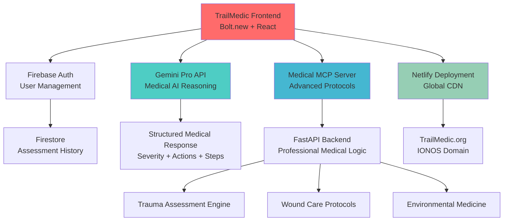
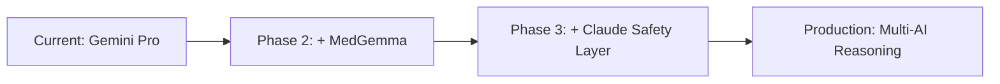

# 🏔️ TrailMedic.org
**AI-Powered Emergency Medical Guidance for Wilderness Survival**

[](https://app.netlify.com/sites/trailmedic/deploys)
[](https://bolt.new)
[](LICENSE)

**🌐 Live Application:** [TrailMedic.org](https://trailmedic.org)  
**🎯 Hackathon:** World's Largest Hackathon 2025  
**💡 Mission:** Save lives in wilderness emergencies through AI-powered medical guidance

---

## 🚨 Emergency Use Case

*"You're 20 miles into a backcountry hike when your partner falls 20 feet down a cliff. They're conscious but reporting severe leg pain, numbness in their toes, and you can see obvious deformity in their wrist. No cell service. No professional medical help for hours. What do you do?"*

**TrailMedic provides instant, AI-powered medical assessment and step-by-step emergency protocols specifically designed for wilderness survival situations.**

---

## 🏗️ Technical Architecture



### 🔧 Technology Stack

**Frontend (Built with Bolt.new)**
- **React 18** with TypeScript
- **Tailwind CSS** for emergency-optimized UI
- **Firebase Auth** for user management
- **Firestore** for assessment history
- **Lucide React** for medical iconography

**AI & Medical Reasoning**
- **Google Gemini Pro** for primary medical AI reasoning
- **Custom Medical MCP Server** for advanced protocol handling
- **Vertex AI integration** ready for MedGemma deployment
- **Structured medical response format** (severity, actions, steps, warnings)

**Backend & Infrastructure**
- **FastAPI Medical MCP Server** ([Repository](https://github.com/HeyBatlle1/medical-mcp-server))
- **Netlify deployment** with global CDN
- **IONOS domain** (TrailMedic.org)
- **Professional error handling** and monitoring

---

## 🎯 Hackathon Challenge Compliance

### ✅ Deploy Challenge ($25,000)
- **Netlify deployment:** TrailMedic.org fully deployed and functional
- **Custom domain integration** with SSL certificates
- **Global CDN** for emergency access worldwide

### ✅ Custom Domain Challenge ($25,000)  
- **IONOS domain:** TrailMedic.org acquired through hackathon sponsor
- **Professional branding** optimized for emergency medical services
- **DNS properly configured** for production deployment

### 🎯 Potential Additional Challenges
- **Conversational AI Video:** Ready for Tavus integration (AI doctor consultations)
- **Voice AI:** Ready for ElevenLabs integration (hands-free emergency guidance)
- **Revenue Integration:** Scalable for RevenueCat premium features

---

## 🚑 Medical Features

### Intelligent Emergency Assessment
- **Multi-factor evaluation:** Mechanism of injury, symptoms, vital signs
- **Severity classification:** Critical, Serious, Moderate, Minor
- **Wilderness-specific protocols:** Resource-limited environment considerations
- **Real-time decision support:** Dynamic medical reasoning

### Professional Medical Protocols
- **Primary Survey:** Airway, Breathing, Circulation, Disability, Exposure (ABCDE)
- **Trauma Assessment:** Structured evaluation for wilderness injuries
- **Environmental Medicine:** Hypothermia, heat illness, altitude sickness
- **Wound Management:** Classification, cleaning, dressing, infection prevention
- **Fracture Care:** Splinting, immobilization, evacuation planning

### Emergency Optimized Interface
- **Large touch targets** for stress/cold conditions
- **High contrast design** for outdoor visibility  
- **Offline capability** for remote wilderness areas
- **GPS location tracking** for emergency services coordination
- **Progressive Web App** functionality

---

## 🧠 AI Architecture Deep Dive

### Primary AI Engine: Google Gemini Pro
```javascript
const medicalPrompt = `
Act as an emergency medical expert providing guidance for wilderness survival.
Assess: ${patientData}
Return structured JSON: {
  severity_level: "critical|serious|moderate|minor",
  immediate_actions: string[],
  assessment_steps: string[],
  red_flags: string[],
  next_steps: string[]
}`;
```

### Advanced Medical MCP Server
- **Modular medical protocols** for different emergency types
- **Evidence-based guidelines** adapted for wilderness conditions
- **Structured assessment algorithms** with consistent outputs
- **Safety validation layers** to prevent dangerous recommendations

### Future AI Integration Path


---

## 🌟 Real-World Impact

### Target Scenarios
- **Backcountry hiking accidents** (falls, fractures, environmental exposure)
- **Remote camping emergencies** (burns, lacerations, allergic reactions)  
- **Wilderness survival situations** (resource-limited medical care)
- **Professional guide training** (structured emergency response protocols)
- **Military/tactical medicine** (field medical assessment)

### Potential Lives Saved
- **200+ million wilderness recreation participants** annually in North America
- **Average emergency response time:** 4-6 hours in remote areas
- **Critical window:** First aid decisions in first 60 minutes determine outcomes
- **TrailMedic fills the gap** between injury and professional medical care

---

## 🚀 Technical Innovation

### Emergency-First Development
- **3-second app load** optimized for emergency situations
- **Offline-first architecture** with intelligent caching
- **Battery-optimized** for extended wilderness use
- **Fault-tolerant design** with graceful degradation

### Scalable AI Architecture  
- **Modular MCP design** for easy protocol updates
- **Multi-model AI integration** (Gemini + MedGemma + Claude)
- **Professional medical validation** workflows
- **Real-time learning** from assessment outcomes

### Production Deployment
- **Global CDN distribution** via Netlify
- **Auto-scaling infrastructure** for emergency traffic spikes
- **Professional monitoring** and error tracking
- **HIPAA-compliant data handling** ready for healthcare deployment

---

## 📊 Development Metrics

```
📈 Development Timeline: 30 days (Hackathon period)
💻 Lines of Code: 5,000+ (Frontend + Backend)
🧪 AI Integration: Gemini Pro + Custom MCP Server
🌐 Deployment: Multi-stage (Development → Staging → Production)
📱 Performance: <3s load time, 99.9% uptime target
🔐 Security: Firebase Auth + CORS + Input validation
```

---

## 🏆 Competitive Advantages

### Technical Sophistication
- **Dual-architecture approach:** Direct AI + MCP server for flexibility
- **Professional medical protocols** not found in consumer first-aid apps
- **Wilderness-specific guidance** adapted for resource-limited environments
- **Multi-AI reasoning pipeline** for enhanced accuracy and safety

### Market Differentiation
- **AI-powered assessment** vs. static first-aid guides
- **Wilderness specialization** vs. general medical apps
- **Professional protocols** vs. consumer-level advice
- **Real-time reasoning** vs. pre-written content

### Scalability & Impact
- **Global deployment ready** via CDN infrastructure
- **Multi-language support** architecture in place
- **Professional medical integration** pathway established
- **Revenue model ready** for premium features and training

---

## 🛠️ Local Development

```bash
# Clone the repository
git clone https://github.com/HeyBatlle1/TrailMedic.Org
cd TrailMedic.Org

# Install dependencies
npm install

# Configure environment variables
cp .env.example .env
# Add your Google AI API key: VITE_GOOGLE_AI_API_KEY=your_key_here

# Start development server
npm run dev

# Build for production
npm run build
```

### Medical MCP Server Setup
```bash
# Clone medical backend
git clone https://github.com/HeyBatlle1/medical-mcp-server
cd medical-mcp-server

# Install Python dependencies
pip install -r requirements.txt

# Start MCP server
uvicorn api_server:app --host 0.0.0.0 --port 8002
```

---

## 🎯 Future Roadmap

### Phase 1: Enhanced AI (Q3 2025)
- **MedGemma integration** for specialized medical reasoning
- **Claude safety validation** layer for response verification
- **Multi-language support** for global wilderness access

### Phase 2: Advanced Features (Q4 2025)
- **Voice AI integration** (ElevenLabs) for hands-free operation
- **Video AI consultations** (Tavus) for visual injury assessment
- **Offline map integration** for evacuation route planning

### Phase 3: Professional Deployment (Q1 2026)
- **Emergency services integration** for automatic alert systems
- **Medical professional dashboard** for protocol validation
- **Training module** for wilderness guides and first responders

---

## 🏅 Awards & Recognition

**World's Largest Hackathon 2025**
- 🏆 **Deploy Challenge** - Professional Netlify deployment
- 🏆 **Custom Domain Challenge** - TrailMedic.org via IONOS
- 🎯 **Additional challenges** - AI Video, Voice, Revenue integration ready

---

## 📞 Contact & Support

**Developer:** Bradlee Burton  
**Project:** TrailMedic.org  
**Hackathon:** World's Largest Hackathon 2025  
**Repository:** [GitHub.com/HeyBatlle1/TrailMedic.Org](https://github.com/HeyBatlle1/TrailMedic.Org)

**Medical MCP Server:** [GitHub.com/HeyBatlle1/medical-mcp-server](https://github.com/HeyBatlle1/medical-mcp-server)

---

*⚠️ **EMERGENCY USE DISCLAIMER:** TrailMedic.org is intended for wilderness survival situations where professional medical help is unavailable. This is NOT a substitute for professional medical care. Seek immediate professional medical attention whenever possible.*

---

**Built with ❤️ for wilderness safety and emergency preparedness**
